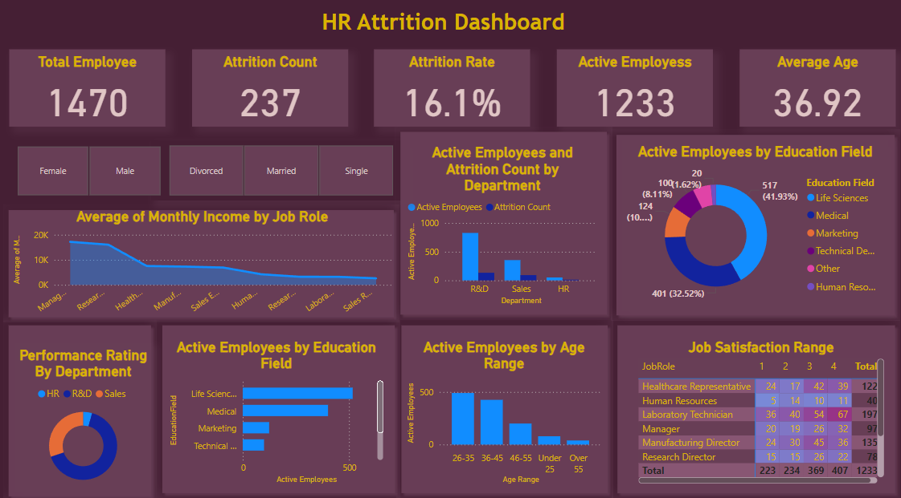

## Attrition-Analytics-Suite-by-Hello-Green

### Hello Green is a firm that is having trouble understanding the reasons that lead to employee turnover. The company wants to know what factors influence employees and how to keep the best ones around. To understand why employees choose to quit, they need to study a variety of characteristics using a data-driven approach, including age, marital status, and distance from home.

A suitable data analysis tool that can be used is Microsoft Power BI. Power BI is a powerful business intelligence tool that allows users to visualize data, create interactive reports and dashboards, and share insights across the organization. It integrates with a wide range of data sources, making it easy to import and analyze data from multiple sources. Power BI also offers advanced analytics capabilities such as predictive modeling and machine learning, enabling organizations to uncover hidden insights in their data.
 
Overall, data analytics tools like Microsoft Power BI can greatly contribute to effective decision making by providing actionable insights from data that drive business growth and success.

